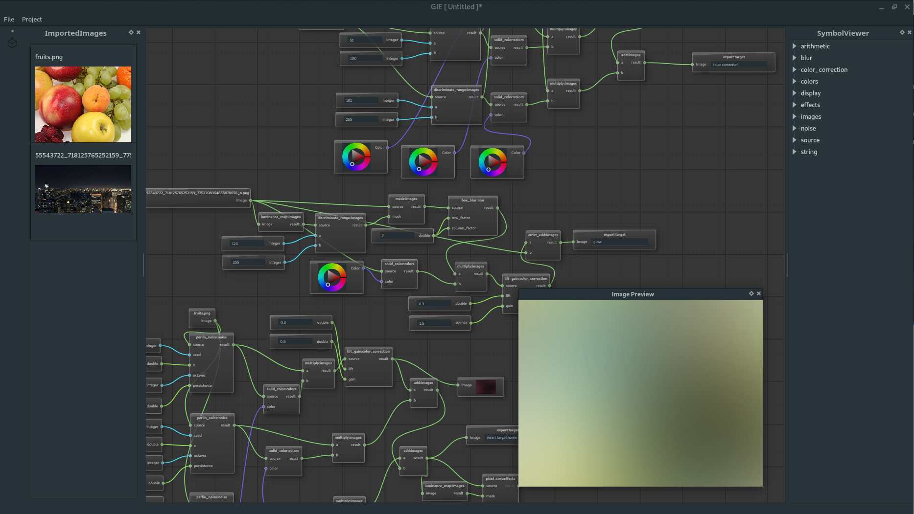

# GIE


GIE (Generative Image Editor, `/jəī/`) is a node based image editor, inspired by Blender's material node editing feature. Building upon the descriptive nature of visual data flow programming, each node represent a mutation done to a source image.



## Usage
The UI is intended to be relatively straight-forward. Much like in Blender, the right click context menu contains all possible nodes. In order to use pictures as sources, the user has to import them through the menu present on the top bar.
Similarly, exporting is done using the export button present on the toolbar menu.

*Documentation of each node's behaviour coming soon*

## Installation
### *nix
*Building has been only attempted on Linux (Manjaro with recent packages). While the code is written to be cross platform, there is no guarantee that it is going to work straight out of the box on Mac OSX, FreeBSD etc. Please open an issue if you find any major issues that you need help with.*

Requirements:
* c++17 compatible compiler (gcc recommended!)
* boost.python
* qt5

```bash
git clone https://github.com/alexge50/gie.git
cd gie
mkdir build; cd build
cmake ..
make
make install
```
**Disclaimer:** Due to a [bug](https://github.com/paceholder/nodeeditor/issues/238) in one of the gie's dependencies with clang on release is not recommended.

### Windows
* binaries coming soon

## TODO
* custom Qt UI theme
* allow user side scripting from the interface - creating nodes that invoke user code
* multi-threading - allowing multiple nodes to be run at the same time
